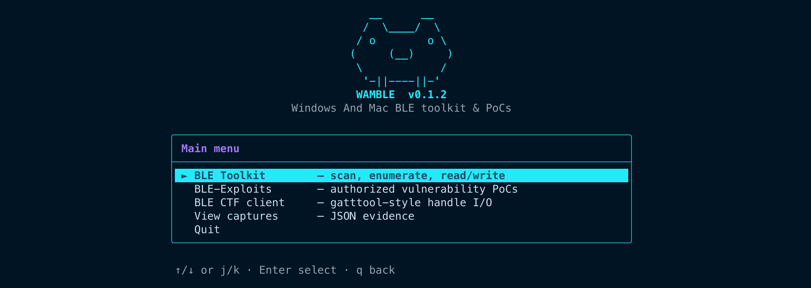

# WAMBLE: Windows And Mac BLE

[](https://github.com/Malaysia-Hardware-Hacking-Community/WAMBLE/actions/workflows/ci.yml)
[](https://github.com/Malaysia-Hardware-Hacking-Community/WAMBLE/actions/workflows/ci.yml)
[](https://github.com/Malaysia-Hardware-Hacking-Community/WAMBLE/actions/workflows/ci.yml)

<p align="center">
  
</p>

Bluetooth Low Energy tooling for **macOS and Windows**, in the shape of the
Linux `gatttool` and BlueZ command-line utilities.

`gatttool`, `bluetoothctl`, `btmgmt` and `hciconfig` are part of the Linux BlueZ
stack. They do not exist on macOS (which talks to Bluetooth through
CoreBluetooth) or on Windows (which uses the WinRT Bluetooth API). WAMBLE
reimplements the parts of that toolkit that are useful for inspecting and poking
at BLE peripherals, using [bleak] for the Bluetooth work and [rich] for terminal
output. Because bleak puts one API in front of CoreBluetooth and WinRT, the same
tools run on both operating systems.

No `sudo`, no `hcitool`, no BlueZ. Just Python.

> **Please use this responsibly.** WAMBLE can read from and write to real
> devices, and the `wamble.exploits` package contains working proof-of-concept
> attacks. Only point it at devices you own or have written permission to test.
> See [SECURITY.md](.github/SECURITY.md).

> **Platform status.** WAMBLE is developed and tested on macOS. Windows support
> runs on bleak's WinRT backend and is expected to work from PowerShell, but has
> not been verified on a Windows machine yet. If you run it on Windows, reports
> and pull requests are welcome. Where macOS and Windows differ, it is called out
> below.

[bleak]: https://github.com/hbldh/bleak
[rich]: https://github.com/Textualize/rich

---

## Requirements

- macOS 11 or newer, or Windows 10 (build 16299+) and Windows 11
- Python 3.11 or newer (uses `asyncio.timeout` and PEP 604 unions)
- Bluetooth enabled, and permission to use it

WAMBLE is the `wamble` package (under `src/`). Installing it gives you the
`wamble-*` commands used throughout this README; you can also run any tool as a
module with `python -m wamble.<tool>`.

### macOS

```bash
python3 -m venv .venv && source .venv/bin/activate
pip install -r requirements.txt
pip install -e .                      # provides the wamble-* commands
```

bleak installs the CoreBluetooth bindings (`pyobjc-framework-corebluetooth`) for
you. The first time a tool touches the adapter, macOS shows a Bluetooth
permission prompt. If you dismissed it, re-enable it under **System Settings >
Privacy & Security > Bluetooth** for your terminal app.

### Windows (PowerShell)

```powershell
py -3 -m venv .venv
.\.venv\Scripts\Activate.ps1
pip install -r requirements.txt
pip install -e .
```

bleak uses the built-in WinRT Bluetooth API, so there are no extra native
packages. Make sure Bluetooth is turned on (**Settings > Bluetooth & devices**).
If PowerShell blocks the activate script, allow it for the session with
`Set-ExecutionPolicy -Scope Process RemoteSigned`. Use `python` (or `py`) in
place of `python3`.

The install adds `wamble-scan`, `wamble-watch`, `wamble-enum`, `wamble-gatt`,
`wamble-find`, `wamble-battery`, `wamble-device-info`, `wamble-mtu`,
`wamble-params` and `wamble-ctf`. Each is the same as `python -m wamble.<tool>`;
for example `wamble-scan -t 15` is `python -m wamble.scan -t 15`.

## Quick start

```bash
./ble_tui.sh                      # menu TUI driving every tool (macOS/Linux shells)
.\ble_tui.ps1                     # same menu TUI, native PowerShell (Windows)
wamble-scan                       # what is advertising near me?
wamble-enum "Device Name"         # what GATT attributes does it expose?
wamble-gatt "Device Name"         # poke at it interactively
```

## Tools

Each command below is also runnable as `python -m wamble.<module>` (the module
is named in the first column), and every tool takes `--help`.

| Command (module)                                                 | Replaces (Linux)                       | What it does                                                                                                                           |
| ---------------------------------------------------------------- | -------------------------------------- | -------------------------------------------------------------------------------------------------------------------------------------- |
| `wamble-scan` ([`scan`](src/wamble/scan.py))                     | `bluetoothctl scan on`, `hcitool scan` | Scan advertisements for a fixed window; names unnamed devices by vendor/beacon. Filter by name, service UUID or RSSI. Dump JSON or CSV. |
| `wamble-watch` ([`watch`](src/wamble/watch.py))                  | `btmon`                                | Live-refreshing view of advertisements, strongest signal first, until interrupted.                                                     |
| `wamble-adv-log` ([`adv_log`](src/wamble/adv_log.py))            | n/a                                    | Log advertisements to CSV over time (one timestamped row per sighting). See [Logging advertisements](#logging-advertisements-over-time). |
| `wamble-notify-log` ([`notify_log`](src/wamble/notify_log.py))   | n/a                                    | Subscribe to a device's notifications and log each one to CSV with timestamps. See [Logging notifications](#logging-notifications).    |
| `wamble-enum` ([`enum`](src/wamble/enum.py))                     | `gatttool -a`                          | Connect, list every service, characteristic and descriptor, and optionally read, list writable, or subscribe. Has a CTF-oriented mode. |
| `wamble-gatt` ([`interactive`](src/wamble/interactive.py))       | `gatttool` interactive mode            | REPL: read, write, subscribe and unsubscribe against a live connection. See the [cheatsheet](docs/GATT-CLI-CHEATSHEET.md).            |
| `wamble-batch` ([`batch`](src/wamble/batch.py))                  | `gatttool` scripting                   | Run a script of the same GATT commands non-interactively, from a file or stdin. See [Scripting](#scripting-batch-commands).            |
| `wamble-find` ([`find`](src/wamble/find.py))                     | `gatttool find`                        | Find characteristics or descriptors by UUID substring.                                                                                 |
| `wamble-battery` ([`battery`](src/wamble/battery.py))            | `gatttool -t Random -n 0x180f`         | Read the standard Battery Level characteristic (`0x2A19`).                                                                             |
| `wamble-profile` ([`profiles`](src/wamble/profiles.py))          | n/a                                    | Subscribe to and decode a SIG measurement profile: Heart Rate, Health Thermometer, or CSC. See [Reading a profile](#reading-a-profile). |
| `wamble-device-info` ([`device_info`](src/wamble/device_info.py))| n/a                                    | Read the Device Information Service (`0x180A`): model, serial, firmware, hardware revisions.                                           |
| `wamble-mtu` ([`mtu`](src/wamble/mtu.py))                        | `gatttool -m`                          | Report the negotiated ATT MTU. Read-only; see [MTU](#mtu-and-connection-parameters).                                                   |
| `wamble-params` ([`params`](src/wamble/params.py))               | `btmgmt conn-update`                   | Read or request the Peripheral Preferred Connection Parameters characteristic (`0x2A04`).                                              |
| `wamble-ctf` ([`ctf`](src/wamble/ctf.py))                        | n/a                                    | Scriptable BLE CTF client (read/write/notify by handle). See below.                                                                   |
| `wamble-export` ([`export`](src/wamble/export.py))               | n/a                                    | Dump the full GATT tree to JSON, or diff two dumps with `--diff` (offline). See [Export and diff](#export-and-diff).                   |
| `wamble-bench` ([`bench`](src/wamble/bench.py))                  | n/a                                    | Benchmark connection time, ATT MTU, and read/notify throughput over repeated samples. See [Benchmarking](#benchmarking).               |
| `wamble-range` ([`range`](src/wamble/range.py))                  | n/a                                    | Track a device's RSSI live (sparkline, warmer/cooler, rough distance) to locate it. See [Tracking a device's signal](#tracking-a-devices-signal). |
| `wamble-targets` ([`targets`](src/wamble/targets.py))            | n/a                                    | Save short aliases for devices (`@name`), so any connecting tool can target them. See [Target profiles](#target-profiles).             |
| [`wamble.common`](src/wamble/common.py), [`wamble.gatt`](src/wamble/gatt.py) | n/a                        | Shared libraries. Not entry points.                                                                                                    |

## Usage

### Scanning

```bash
wamble-scan -t 15                          # 15 second scan
wamble-scan -n Fitbit                      # only names containing "Fitbit"
wamble-scan -s 180f                        # only devices advertising 0x180F
wamble-scan -m -70                         # ignore anything weaker than -70 dBm
wamble-scan --plain                        # no table, pipe-friendly
wamble-scan --write-to scan.json           # save results as JSON
wamble-scan --csv scan.csv                 # save results as CSV (one row per device)
```

`--write-to` and `--csv` can be combined to write both at once, and both carry
the same per-device fields.

A device that advertises no name is not left as a bare `(unnamed)`: WAMBLE reads
its advertisement and shows what it is. The manufacturer company ID is decoded to
a vendor name (a curated set of common vendors, e.g. `Apple`, `Samsung`,
`Google`), and for Apple devices the Continuity message type is decoded too, so a
row reads `· Apple · Nearby Info`, `· Apple · Find My`, `· Apple · AirDrop`, and
so on. iBeacon and Eddystone frames are recognised, and a Proximity Pairing
message names the accessory model (`AirPods`, `AirPods Pro`, `Beats ...`) from a
curated table. The advertised-services column names known UUIDs too.
`wamble-watch` does the same in its live view.

A passive scan **cannot** reveal a phone's exact model (iPhone 15 vs 13, Galaxy
S21 vs Pixel): that is deliberately not broadcast. The reliable place a model
string lives is the Device Information Service, which you read by connecting, so
`wamble-enum` prints a `Device:` line with the manufacturer and model when the
device exposes it (many accessories and IoT devices do; phones do not).

Once `wamble-enum` has read that model string, it remembers it against the device
address, so the next `wamble-scan` or `wamble-watch` labels that same device with
what you enumerated it as instead of showing `(unnamed)` again. The advertised
name always wins when present; the learned name only fills a blank. The cache is
`identities.json` next to the targets file, overridable with `$WAMBLE_IDENTITIES`.

### Watching advertisements live

```bash
wamble-watch                      # refresh until Ctrl-C
wamble-watch --name Acme --timeout 60
```

### Logging advertisements over time

Where `wamble-watch` shows a live view, `wamble-adv-log` appends a timestamped
CSV row per advertisement sighting, so you get a time-series of presence and RSSI
to analyse later:

```bash
wamble-adv-log -o log.csv                 # log everything until Ctrl-C
wamble-adv-log -o log.csv --timeout 300   # log for five minutes
wamble-adv-log -n Fitbit --min-interval 5 # one row per matching device per 5s
```

Columns are `timestamp, address, name, rssi, service_uuids, manufacturer`. With
no `-o` the CSV goes to stdout (status stays on stderr) so it pipes cleanly, and
`--min-interval` throttles how often each device is logged.

### Logging notifications

`wamble-notify-log` subscribes to a connected device's notify/indicate
characteristics and appends a timestamped CSV row per notification, so you can
capture a sensor's stream to a file:

```bash
wamble-notify-log "HR Monitor" -o hr.csv            # all notify/indicate chars
wamble-notify-log "HR Monitor" -c 2a37 --timeout 60 # just one, for a minute
```

Columns are `timestamp, elapsed, characteristic, handle, length, value_hex,
text` (the `text` column shows a printable rendering when the bytes are text).
By default it subscribes to every notify/indicate characteristic; name specific
ones with repeated `-c`.

### Enumerating GATT attributes

```bash
wamble-enum "Acme Tracker"
wamble-enum "Acme Tracker" --readable       # read everything readable
wamble-enum "Acme Tracker" --filter-uuid 2a  # just UUIDs containing "2a"
wamble-enum "Acme Tracker" --notify          # subscribe and stream updates
```

### Interactive client

```bash
$ wamble-gatt "Acme Tracker"
[gatt] read 2a19
[gatt] notify 2a37
[gatt] write-req 6e000001 0100
[gatt] unnotify 2a37
[gatt] quit
```

Commands: `services`, `characteristics`, `descriptors`, `read`, `write-req`,
`write-cmd`, `notify`, `indicate`, `unnotify`, `reconnect`, `help`, `quit`. The
read, write and subscribe commands take a UUID substring or a handle, matched
case-insensitively. The [cheatsheet](docs/GATT-CLI-CHEATSHEET.md) explains each
command and how to build payloads.

### Scripting (batch commands)

`wamble-batch` runs the same commands from a file (or stdin) instead of the
prompt, against one connection, then disconnects. It adds a `wait <seconds>`
line for holding the link open, which is useful after `notify` to capture a few
updates:

```bash
wamble-batch "Device Name" script.txt
cat script.txt | wamble-batch "Device Name" -      # read the script from stdin
```

```
# script.txt — same commands as the prompt, plus wait
services
write-cmd 00010203-0405-0607-0809-0a0b0c0d2b11 3305020000...
notify 2a37
wait 5
quit
```

Blank lines are skipped and anything after `#` is a comment.

### Finding a UUID, device info, battery

```bash
wamble-find "Acme Tracker" 2a19
wamble-find "Acme Tracker" 2902 --target descr
wamble-device-info "Acme Tracker"
wamble-battery "Acme Tracker"
```

### Reading a profile

`wamble-profile` subscribes to a standard SIG measurement characteristic and
prints a decoded reading per update. It knows Heart Rate (`0x2A37`), the Health
Thermometer (`0x2A1C`) and Cycling Speed & Cadence (`0x2A5B`):

```bash
wamble-profile "HR Monitor"                 # auto-detect which profile is present
wamble-profile "HR Monitor" -p heart-rate   # 72 bpm (contact)
wamble-profile "Thermometer" --timeout 30   # 37.0 °C
```

With no `-p` it auto-detects the first supported profile the device exposes.

### Export and diff

Snapshot a device's whole GATT tree to JSON, then compare two snapshots offline
(handy for spotting what a firmware update changed, or how two units differ):

```bash
wamble-export "Acme Tracker"                       # print the GATT tree as JSON
wamble-export "Acme Tracker" -o before.json        # save a snapshot
wamble-export "Acme Tracker" -o after.json         # ...and another later
wamble-export --diff before.json after.json        # what changed (no device needed)
```

The diff reports services and characteristics added or removed, descriptors
added or removed, and characteristic properties that changed. The snapshot is
sorted and stable, so re-exporting the same device diffs clean.

### Benchmarking

Measure how a link actually performs, which is useful for diagnosing a flaky or
slow device:

```bash
wamble-bench "Acme Tracker"                       # 5 connects + 3s read throughput
wamble-bench "Acme Tracker" -n 10                 # 10 connection samples
wamble-bench "Acme Tracker" --read-seconds 0      # skip the read throughput phase
wamble-bench "Acme Tracker" --notify-seconds 5    # also measure notifications/sec
wamble-bench "Acme Tracker" --read-char 2a37      # read a specific characteristic
```

It reports connection time (min/median/mean/max) over the samples, how many
connects succeeded, the negotiated ATT MTU, and read/notification throughput. By
default it reads the first readable characteristic; a device is free to refuse a
read, in which case that phase stops early and the rest of the report still
prints. It uses only cross-platform `bleak` calls, so it works the same on macOS
and Windows.

### Tracking a device's signal

Follow one device's signal strength to physically locate it, like a
"hotter / colder" game:

```bash
wamble-range "Acme Tag"                      # live RSSI until Ctrl-C
wamble-range "Acme Tag" --timeout 60         # stop after a minute
wamble-range "Acme Tag" --tx-power -65       # calibrate the 1 m reference RSSI
wamble-range "Acme Tag" --path-loss 3.0      # indoor environment exponent
```

It shows the current RSSI, a sparkline of recent samples, a warmer/cooler trend
(so you know if you are closing in), and a rough distance estimate. The distance
is a guide, not a measurement: BLE RSSI is noisy, so calibrate `--tx-power` (the
RSSI at one metre) and `--path-loss` for your device and surroundings. It reads
the advertisement RSSI the scanner reports, so it works the same on macOS and
Windows.

### Target profiles

Typing a device name or address every time gets old, especially on macOS where
the address is a long per-host UUID that changes between reboots. Save a short
alias once, then target it with `@name` from any connecting tool:

```bash
wamble-targets add tv "[TV] Samsung Q60 Series"   # save an alias
wamble-targets add led "GBK_H619A"
wamble-targets list                               # show saved aliases
wamble-enum @tv                                   # use it anywhere
wamble-battery @led
wamble-targets remove tv                          # delete an alias
wamble-targets path                               # where the file lives
```

An alias maps to whatever you would otherwise type: a name substring or an
address. Aliases are stored in a small JSON file (run `wamble-targets path` to
see where). An unknown `@name` is reported as "not found", the same as any other
target that is not nearby.

## Menu TUI, exploits, and CTF client

Beyond the individual tools, WAMBLE ships three extras, all built on the same
`bleak` core, so the same cross-platform expectations apply:

- **[`ble_tui.sh`](ble_tui.sh)** and **[`ble_tui.ps1`](ble_tui.ps1)**: a
  keyboard-driven menu that launches every tool below, prompts for the device and
  arguments, and includes a captures viewer. Use the **`.sh`** on macOS and Linux
  shells (or WSL and Git Bash), and the **`.ps1`** natively in PowerShell on
  Windows. You can also call the tools directly. Both launchers have identical
  menus.
- **[`wamble.exploits`](src/wamble/exploits/)**: a suite of authorized,
  non-destructive BLE vulnerability demonstrations (unauthenticated GATT harvest,
  posture assessment, LED control PoC, notification capture, capture-replay,
  persistence, device-name defacement, passive advertisement harvest), each
  targeting one named device, for hardware you own. Run them as
  `python -m wamble.exploits.<tool>`. See
  [the exploits README](src/wamble/exploits/README.md).
- **`wamble-ctf`** ([`wamble.ctf`](src/wamble/ctf.py)): a gatttool-style,
  scriptable client for a hackgnar-style BLE CTF (read, write and notify by
  handle, read-loop, score and submit). On macOS it solves 16 of 20 flags. The
  other 4 need Linux and BlueZ (set-MAC and force-MTU, plus two
  hidden-notification flags CoreBluetooth cannot subscribe to). On Windows the ATT
  handles match the Linux walkthrough directly.

These carry an authorization gate on anything that transmits. Use them only
against devices you own or are authorized to test.

## Platform differences and limits

This is the honest part. CoreBluetooth and WinRT both expose far less than BlueZ,
and some of `gatttool`'s most-used features have no cross-platform equivalent.

**Device address.** On **Windows** and **Linux**, `BLEDevice.address` is the
peripheral's real Bluetooth MAC. It is stable, and it is the thing you can pass as
a target. On **macOS**, CoreBluetooth hides the MAC and hands you a per-host UUID
instead, which changes across reboots. On macOS, prefer a **name substring**. On
Windows you can use either the name or the MAC. All tools accept either.

**ATT handles.** BlueZ and `gatttool` expose the real ATT handle of each
attribute. WinRT exposes real handles. **CoreBluetooth does not**, so bleak
synthesizes a handle on macOS that is the characteristic _declaration_ handle, one
below the `gatttool` _value_ handle. If a handle from a Linux walkthrough does not
resolve on macOS, try one lower, or address the attribute by UUID, which always
works.

**No scripted pairing on macOS.** `bleak` exposes `BleakClient.pair()`. On Windows
it drives the OS pairing flow, but on CoreBluetooth pairing is OS-driven and
cannot be scripted the way `bluetoothctl pair <mac>` can on Linux.

**No raw packet capture.** Neither macOS nor Windows hands applications the raw
advertisement and HCI stream the way a BlueZ sniffer (`btmon`) does.

### MTU and connection parameters

`wamble-mtu` **reports** the negotiated MTU. It cannot set it. Both CoreBluetooth
and WinRT negotiate the ATT MTU themselves at connection setup and expose it
read-only (`BleakClient.mtu_size`). Linux `gatttool -m` can force an MTU because it
binds to BlueZ's HCI socket. There is no equivalent on macOS or Windows.

`wamble-params` reads the Peripheral Preferred Connection Parameters
characteristic (`0x2A04`) on the GAP service (`0x1800`). These are the values the
peripheral _prefers_, not the values in force. With `--set` it attempts to write
them, but PPCP is read-only on most peripherals, so the write is usually rejected.
Even a central that wants to change a live connection has to do it over the link
layer, which neither CoreBluetooth nor WinRT exposes. Many peripherals (including
cheap LED controllers) do not expose PPCP at all, and `wamble-params` says so
clearly when that is the case.

On Linux and BlueZ, `mtu_size` always reports 23 regardless of the real link MTU,
so `wamble-mtu` is only meaningful on macOS and Windows.

## Notes on bleak

Written against bleak 3.x.

- `BleakScanner.find_device_by_name()` matches `local_name` exactly. These tools
  match on a substring, so `wamble.common.find_device()` scans advertisements and
  returns as soon as one matches.
- Matching on first sight returns as soon as a device matches rather than sleeping
  for the full timeout.

## Troubleshooting

**Nothing is found, or no permission prompt.**

- macOS: Bluetooth access is off for your terminal. Enable it under
  **System Settings > Privacy & Security > Bluetooth**.
- Windows: make sure Bluetooth is on in **Settings > Bluetooth & devices**, and
  that the app has Bluetooth permission.

**Connects then drops, or `Services discovery failed`.** Some cheap devices need a
moment after connect. Retry, or raise `--connect-timeout`.

**Reads return empty, or `Insufficient Authentication`.** The characteristic
requires bonding or encryption, and neither OS lets you force that pairing from a
script.

**A handle from a Linux writeup does not resolve on macOS.** See _ATT handles_
above. Address by UUID, or try the handle one lower.

## Tests

The pure logic (UUID handling, GATT target resolution, long writes, advertisement
parsing) is tested without a Bluetooth adapter and runs on any OS:

```bash
python -m pytest -q        # no hardware required
```

## Contributing

Contributions of every kind are welcome, including bug reports, device
compatibility reports, docs, and code. See
[CONTRIBUTING.md](.github/CONTRIBUTING.md) to get started, and please read the
[Code of Conduct](.github/CODE_OF_CONDUCT.md).

In short: keep each tool runnable as a module, put shared helpers in
`wamble/common.py` and `wamble/gatt.py`, run `python -m pytest -q` before you
open a pull request, and only test against devices you own or are allowed to
test.

## Repository layout

```
src/wamble/            the toolkit package (one module per tool)
  cli.py               the wamble-* console entry points
  common.py, gatt.py   shared Bluetooth helpers
  exploits/            authorized vulnerability demonstrations
ble_tui.sh, ble_tui.ps1  menu front-ends
tests/                 hardware-free test suite
docs/                  cheatsheet, governance, authors, CTF walkthrough
.github/               contributing, code of conduct, security, support, CI
```

## Project files

- [CONTRIBUTING.md](.github/CONTRIBUTING.md): how to set up, test, and submit a change
- [CODE_OF_CONDUCT.md](.github/CODE_OF_CONDUCT.md): the community standards we follow
- [SECURITY.md](.github/SECURITY.md): responsible use and how to report a security problem
- [SUPPORT.md](.github/SUPPORT.md): where to get help
- [GOVERNANCE.md](docs/GOVERNANCE.md): how decisions are made
- [GATT-CLI-CHEATSHEET.md](docs/GATT-CLI-CHEATSHEET.md): the interactive client reference
- [CHANGELOG.md](CHANGELOG.md): notable changes over time

## License

[MIT](LICENSE). Copyright (c) 2026 Malaysia Hardware Hacking Community.
